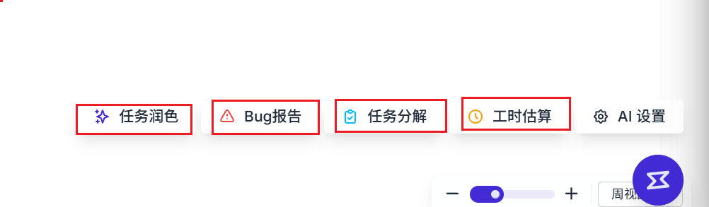

# 优化
-1.调用ai接口报错，要提示处理 {
    "error": {
        "message": "Sorry, you have reached the limit of the free model quota. Please switch to a paid model to enjoy unlimited concurrency. https://console.aihubmix.com/topup (tid: 2026011809101078961687529929957)",
        "type": "Aihubmix_api_error"
    },
    "type": "error"
}
-2.点击开始对话没有反应，如果没有实现相关功能就去掉
-3.点击润色任务名称没有反应
-4.

-4.AI交互侧边栏样式和交互优化，允许用户和AI进行交互，优化结果。
-5.优化结果的呈现也需要优化，有些思考模型会附带思考过程，等其他总结信息，这部分信息是不需要替换的，例如任务名润色，一般任务名也不会太长。让AI的返回，以JSON的形式，表示优化前和优化后的结果，页面需要对JSON进行解析，用户可以操作应用还是撤回都行
-6.AI交互中，在调用某一类AIagent时，提供提示词修改功能，用户可以修改提示词，注意只能修改部分，例如影响返回结构的提示词是不允许修改的，如果应该是json返回，用户改为返回text，那么可能影响功能
-7.AI交互中，提供一个按钮，点击后，AI会重新调用，重新返回结果
-8.AI交互中使用token透明化，用户可以清楚的看到当前聊天token使用情况
-9.AI交互弹窗的调整，一定要参考最佳实践，和成熟的产品
-10.任务编辑页，加一个任务概述列，长文本录入，任务名称短文本录入，任务名称是必填，任务概述是选填
