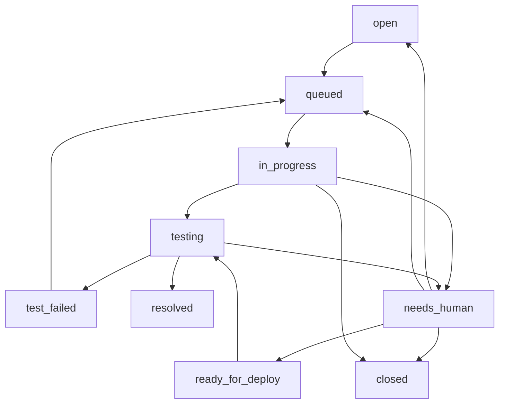

# Feedback Iteration Workflow Design

## Goal

Turn the feedback board from a passive issue list into an AI-assisted iteration workflow. The workflow must distinguish bugs, optimizations, and requirements, let AI resolve safe fixes automatically, and route larger changes through an explicit design and human decision step before implementation.

## Current Problems

The existing feedback system stores a `type` string, but it currently behaves more like a submission source such as `manual` or `auto_error` than a business classification. The system cannot reliably distinguish bug reports, small optimizations, larger optimizations, and new requirements.

The workflow status model also lacks a clear human-decision loop. `needs_human` currently says that automation stopped, but it does not clearly say what the human should do, how the issue should return to automation, or whether AI should create a design before implementation.

## Design Principles

- Keep workflow statuses small and lifecycle-oriented.
- Do not add a new status for every reason automation may pause.
- Use task classification fields to describe what the feedback is.
- Use structured internal notes to describe the exact human action required.
- Let AI handle bugs and small optimizations when verification is practical.
- Require design and human approval for larger optimizations, new requirements, and behavior changes that require product judgment.
- Preserve backward compatibility for existing feedback records.

## Core Concepts

### Submission Source

`sourceType` describes how the feedback was created.

Allowed values:

- `manual`: submitted by a user through the feedback UI.
- `auto_error`: generated automatically from runtime error reporting.
- `admin`: created or corrected by an administrator.

Existing records that only have `type` should be read as `sourceType` when the value is `manual` or `auto_error`.

### Business Type

`businessType` describes what kind of work the feedback represents.

Allowed values:

- `bug`: broken behavior, error, regression, or incorrect result.
- `improvement`: improvement to an existing behavior or experience.
- `requirement`: new capability, workflow, integration, or product behavior.
- `other`: support, question, duplicate, invalid record, or item outside product work.
- `unclear`: insufficient evidence to classify confidently.

Users may optionally choose a business type when submitting feedback. AI must still classify or correct the type during triage.

### Scope

`scope` describes how large and risky the change appears.

Allowed values:

- `small`: local change, clear acceptance, easy verification.
- `medium`: user-visible change with limited blast radius.
- `large`: broad change, new workflow, product decision, or multi-module behavior.
- `unclear`: insufficient evidence to estimate scope.

### Automation Decision

`automationDecision` describes the next automation strategy.

Allowed values:

- `auto_fix`: AI can implement and verify directly.
- `design_required`: AI should generate a design before implementation.
- `need_reproduction`: missing evidence blocks analysis.
- `review_required`: AI has a candidate implementation that needs human review.
- `developer_fix_required`: AI should not implement directly.
- `close`: no product work should happen.

These values are not workflow statuses. They are classification and routing metadata stored in internal notes or a future structured workflow object.

## Workflow Statuses

The workflow should keep the current small lifecycle state machine:

- `open`: new or reopened feedback.
- `queued`: selected for AI processing.
- `in_progress`: AI is triaging, designing, or implementing.
- `testing`: verification, merge, deploy, or smoke check is running.
- `test_failed`: automation attempted a fix but verification failed.
- `needs_human`: automation is paused until a specific human action is completed.
- `ready_for_deploy`: human approved a registered candidate for merge/deploy.
- `resolved`: successful terminal state.
- `closed`: no-action terminal state.

## State Machine



Terminal states:

- `resolved`
- `closed`

`needs_human` is not terminal. It is a pause point with a required return path.

## Human Action Model

Every `needs_human` issue must include a structured block in `internalNote`.

```text
[feedback-agent-human-action]
type=<need_reproduction|design_decision|review_required|developer_fix_required|blocked_external>
requestedAction=<one concise instruction for the human>
evidenceInspected=<what the agent checked>
returnPath=<status the human should set after acting>
[/feedback-agent-human-action]
```

Allowed human action types:

- `need_reproduction`: AI cannot classify or reproduce the issue. The human should add missing steps, expected result, actual result, environment, screenshot, replay, or logs, then set status to `open` or `queued`.
- `design_decision`: AI generated a requirement or optimization design. The human should approve, revise, or reject it. Approved or revised work returns to `queued`; rejected work moves to `closed`.
- `review_required`: AI created a candidate implementation but cannot safely merge it without human review. The human should inspect the candidate metadata, then set status to `ready_for_deploy` if approved, `closed` if rejected, or `queued` with notes if more AI work is needed.
- `developer_fix_required`: AI should not implement directly because the change needs product ownership, protected code boundaries, external credentials, or architecture-level judgment. The human should implement or clarify, then set the appropriate next status.
- `blocked_external`: automation is blocked by external service access, deployment credentials, or unavailable environment. The human should resolve the blocker, then set status to `open` or `queued`.

## AI Classification Flow

When processing `open`, `queued`, or retryable `test_failed` issues, the Agent should:

1. Read public and admin detail, including title, description, context, attachments, logs, replay metadata, and history.
2. Classify `businessType`, `scope`, and `automationDecision`.
3. Write the classification to `internalNote`.
4. Choose the next route:
   - Bug or small optimization with clear verification: `auto_fix`.
   - Large optimization or requirement: `design_required`.
   - Missing evidence: `need_reproduction`.
   - Reviewable candidate but not safe to merge: `review_required`.
   - Product or architecture decision outside automation: `developer_fix_required`.
   - Duplicate, invalid, or no-action item: `close`.

Classification should prefer conservative escalation when acceptance cannot be verified by tests, browser checks, or a clear smoke check.

## Bug And Small Optimization Flow

For `businessType=bug` or `businessType=improvement` with `scope=small`:

1. Move `open` or `queued` to `in_progress`.
2. Reproduce the issue or write a failing regression test when practical.
3. Implement the smallest focused fix.
4. Move to `testing`.
5. Run targeted verification and required quality-gate checks.
6. If verification passes and the change is safe, commit and merge to `master`.
7. Run post-merge verification in the primary worktree.
8. Deploy when the changed surface requires deployment and the deployment path is available.
9. Move to `resolved` with public fix summary and internal verification evidence.

If verification fails and automation can retry, move to `test_failed`. If the failure requires a decision, move to `needs_human` with `humanAction=review_required` or `blocked_external`.

## Requirement And Larger Optimization Flow

For `businessType=requirement` or `businessType=improvement` with `scope=large`:

1. Move to `in_progress`.
2. Analyze the feedback and existing product behavior.
3. Generate a design block in `internalNote`.
4. Move to `needs_human` with `humanAction=design_decision`.
5. Human reviews the design:
   - Approve as written: set status to `queued`.
   - Revise design in internal notes: set status to `queued`.
   - Reject or defer: set status to `closed`.
6. On the next Agent run, the Agent reads the approved design and implements according to the normal implementation and verification flow.

AI must not implement a large optimization or new requirement before the design decision is approved.

## Design Artifact Format

Requirement and larger optimization analysis should use this internal note block:

```text
[feedback-agent-design]
businessType=<bug|improvement|requirement|other|unclear>
scope=<small|medium|large|unclear>
problem=<what user problem or opportunity this addresses>
currentBehavior=<how the product behaves now>
proposedChange=<specific behavior change or new capability>
userValue=<why this helps the user>
affectedAreas=<comma-separated modules, screens, APIs, or workflows>
acceptanceCriteria=<clear pass/fail bullets or numbered criteria>
risks=<main product, technical, data, or UX risks>
implementationOutline=<short implementation strategy>
verificationPlan=<tests, browser checks, smoke checks, or manual checks>
decisionNeeded=<approve|revise|reject>
[/feedback-agent-design]
```

For small improvements that AI can safely implement directly, this full design block is optional. The Agent should still record a short classification and verification rationale.

## Candidate Implementation Metadata

When AI creates code that is not immediately merged, it must register candidate metadata:

```text
[feedback-agent-candidate]
feedbackKey=<feedback key>
candidateWorktree=<absolute worktree path>
candidateBranch=<branch name or detached HEAD if not committed>
baseCommit=<commit the worktree started from>
changeCommit=<commit containing the candidate, or empty if uncommitted>
changedFiles=<comma-separated repo-relative paths>
verification=<short command/result summary>
candidateStatus=<needs_human|ready_for_deploy|merged|abandoned>
createdAt=<ISO timestamp>
[/feedback-agent-candidate]
```

The Agent must use this metadata when processing `ready_for_deploy`. It must not guess which worktree to merge.

## User Submission UX

The feedback form should add an optional business type selector:

- Bug
- Optimization
- Requirement
- Other
- Not sure

Default value: Not sure.

The form should keep the existing low-friction submission flow. The selector helps triage but does not replace AI classification.

Submitted payload should include:

```json
{
  "sourceType": "manual",
  "submittedType": "bug",
  "title": "Cannot save task",
  "description": "Click save and the task disappears.",
  "contact": "user@example.com"
}
```

The Worker should accept missing `submittedType` and normalize it to `unclear`.

## Admin Board UX

The issue detail should show:

- Submitted type.
- AI-classified business type.
- Scope.
- Automation decision.
- Current workflow status.
- Human action block rendered as a readable next-step panel when status is `needs_human`.
- Design block rendered as a structured design review section when present.
- Candidate metadata rendered as a review/deploy panel when present.

The admin can still edit raw notes, but the UI should make the next action visible without requiring manual parsing of internal note blocks.

## Data Model

Feedback records should remain backward compatible. New fields are optional.

```js
{
    sourceType: 'manual',
    submittedType: 'bug',
    ai: {
        businessType: 'bug',
        scope: 'small',
        automationDecision: 'auto_fix',
        classifiedAt: '2026-06-17T12:00:00.000Z',
        confidence: 'medium'
    },
    workflow: {
        status: 'open',
        priority: 'medium',
        assignee: '',
        publicNote: '',
        internalNote: '',
        updatedAt: '2026-06-17T12:00:00.000Z',
        history: []
    }
}
```

Existing `type` values should continue to be returned for compatibility. New code should prefer:

- `sourceType` for submission source.
- `submittedType` for user-selected business type.
- `ai.businessType` for AI classification.

## API Changes

### `POST /api/feedback`

Accept optional fields:

- `sourceType`
- `submittedType`

If not provided:

- `sourceType` defaults to `manual`.
- `submittedType` defaults to `unclear`.

Automatic runtime reports should send:

- `sourceType=auto_error`
- `submittedType=bug`

### `GET /api/feedback/issues`

Public summaries may include:

- `submittedType`
- `businessType`
- `scope`

Internal-only fields such as design blocks and candidate metadata remain admin-only unless copied into `publicNote`.

### `PATCH /api/feedback/issues/:key`

Admin updates should allow:

- `sourceType`
- `submittedType`
- `ai.businessType`
- `ai.scope`
- `ai.automationDecision`

The Worker should validate enum values and append changes to history.

## Automation Prompt Changes

The scheduled Agent should be updated to:

- Classify every selected issue before implementation.
- Treat task type and status separately.
- Generate `feedback-agent-design` for requirements and larger optimizations.
- Use `needs_human` plus `humanAction=design_decision` for design approval.
- Resume implementation when a human sets the issue back to `queued` with an approved or revised design.
- Use `ready_for_deploy` only for approved candidate implementations that should be merged/deployed.
- Avoid adding new statuses when a structured human action is sufficient.

## Migration And Compatibility

Existing records require no bulk migration.

Read-time normalization should map:

- Missing `sourceType` to existing `type` when `type` is `manual` or `auto_error`.
- Missing `submittedType` to `unclear`.
- Missing `ai.businessType` to `unclear`.
- Missing `ai.scope` to `unclear`.
- Missing `ai.automationDecision` to an empty value until the Agent classifies it.

The admin UI should allow editing and saving new fields without breaking older records.

## Testing

Worker unit tests:

- Accept feedback with `submittedType=bug`.
- Default missing `submittedType` to `unclear`.
- Preserve backward compatibility for existing `type=manual` records.
- Reject invalid business type values on admin update.
- Return classification fields in admin detail.
- Keep sensitive design/candidate/internal note details out of public responses unless intentionally public.

Feedback service tests:

- Manual feedback submits selected business type.
- Missing selection submits `submittedType=unclear`.
- Runtime error reports submit `sourceType=auto_error` and `submittedType=bug`.

Admin board tests:

- Status list still uses the small lifecycle state set.
- `needs_human` detail renders the structured human action as a next-step panel.
- Design blocks render as reviewable sections.
- Candidate metadata renders enough information to identify the worktree and branch.

Automation verification:

- Bug issue with clear evidence routes to `auto_fix`.
- Missing reproduction routes to `needs_human` with `humanAction=need_reproduction`.
- Requirement routes to `needs_human` with `humanAction=design_decision` and a design block.
- Approved design returning to `queued` is implemented by the next run.
- Approved candidate in `ready_for_deploy` is merged using candidate metadata, not reimplemented.

## Rollout

1. Update Worker data normalization and validation.
2. Update feedback submission UI and service payload.
3. Update admin board display for classification, human actions, designs, and candidates.
4. Update Worker and frontend tests.
5. Update the scheduled Agent prompt.
6. Deploy Worker changes.
7. Smoke test:
   - Submit a bug.
   - Submit a requirement.
   - Confirm AI/admin classification fields are visible.
   - Confirm requirement enters `needs_human` with a design decision action.
   - Confirm approving by setting `queued` lets automation continue.

## Out Of Scope

- Full project management system.
- Public voting or public comments.
- Multi-admin permission levels.
- Automatic product roadmap prioritization.
- External issue tracker synchronization.
- Replacing Superpowers specs; feedback-generated designs should reference the same design discipline but remain attached to feedback issues.

## Final Design Decision

Use a small workflow status state machine plus structured classification and human-action metadata. Bugs and small optimizations can be automated directly. Larger optimizations and requirements must first produce an AI-generated design, pause in `needs_human` for human decision, and return to `queued` only after approval or revision.
