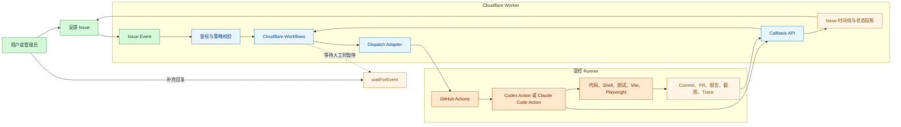
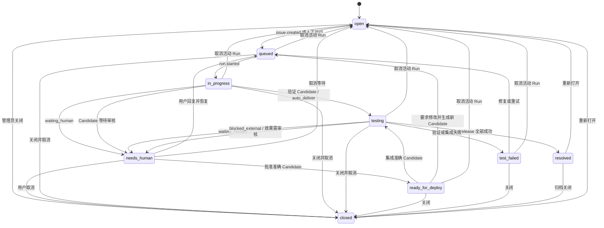

# 反馈处理工作台 V2 — Issue 驱动的 AI 分析、实现与验证闭环

> 状态：技术评审修订中；完成 Phase 0 可行性门禁后冻结  
> 版本：1.3  
> 日期：2026-07-28  
> 原型：[feedback-workbench-v2-prototype.html](./feedback-workbench-v2-prototype.html)  
> 业务场景合同：[tests/scenarios/feedback-workbench.md](../../../tests/scenarios/feedback-workbench.md)

## 1. 执行摘要

反馈处理工作台 V2 将现有“表单详情 + 定时轮询 Codex”升级为：

1. 以 GitHub Issue 风格时间线承载用户、管理员、Agent、系统状态和交付物。
2. 以事件触发 Cloudflare Workflows，停止高频空跑；只保留低频兜底巡检。
3. 以官方 Codex Action 和 Claude Code Action 驱动代码 Agent，不自研 Agent 框架。
4. 以 GitHub Runner 提供代码检出、依赖安装、构建、测试、本地服务和 Playwright 环境。
5. 以统一 Callback 契约回写分析、提问、测试证据、Commit/PR 和最终状态。
6. 以确定性任务策略和权限配置决定“只分析、实现、实现并验证、审查或本地执行”。
7. 以 Issue capability、actor 矩阵、有限配额和机械化 diff gate 约束匿名输入、成本与提权。
8. 以 `gantt-share` Worker + D1/R2 作为 V2 唯一新写入落点；KV 只用于旧数据兼容读取。
9. 以结构化 HumanAction、Design、Candidate 和 Release 延续旧处理器已验证的人工交接、
   准确候选集成、部署与 smoke 能力。
10. 对可信、低风险且可自动验证的问题启用分级自治；自动化成功标准是交付闭环，不是单次
    Agent Run 成功。

V2 首期不要求常驻 SDK Runner。Codex/Claude 官方 Action 能在 Runner 工作区中修改代码、启动
Vite、执行测试和 Playwright。只有任务依赖内网、个人桌面、既有浏览器登录态或特殊硬件时，
才进入需要人工批准的 Self-hosted Runner。

## 2. 背景与现状

### 2.1 已有能力

当前实现已经具备：

- `POST /api/feedback` 收集反馈并写入 `FEEDBACK_KV`。
- `GET /api/feedback/issues` 和 `GET/PATCH /api/feedback/issues/:key`。
- 管理员会话、状态、优先级、负责人、公开备注和内部备注。
- `workflow.history` 最近 50 条变更记录。
- `bug`、`improvement`、`requirement` 等业务分类。
- `auto_fix`、`design_required`、`need_reproduction` 等自动化决策。
- `feedback-agent-human-action`、`feedback-agent-design`、
  `feedback-agent-candidate` 等内部备注块。
- `FEEDBACK_WEBHOOK_URL` 在新反馈创建时执行一次裸 HTTP POST。

### 2.2 现有问题

- 详情页以表单和状态字段为主，用户对“发生了什么、下一步是谁处理”理解成本高。
- `workflow.history` 记录字段变化，不足以承载完整对话、Run 和交付物。
- Webhook 只在 `issue.created` 时调用，无签名、事件类型、幂等、重试或 DLQ。
- 后续回复、重开、状态变化无法即时唤醒处理流程。
- 定时任务响应慢，且多数运行没有待处理事项。
- 内部备注中的 Agent 块是文本协议，缺少结构化版本、校验和查询能力。
- 任务策略、Agent 驱动、Runner 环境和工具权限目前混为一个“处理服务端点”概念。

## 3. 目标

### 3.1 产品目标

- 用户能像使用 GitHub Issue 一样查看并继续一个问题。
- Agent 的每次分析、执行、提问和交付都有可追溯时间线。
- 新事件在秒级进入处理流程，不依赖 30～60 分钟轮询。
- 分析任务能检索最佳实践并输出有来源的方案。
- Bug 和需求任务能完成“修改代码 → 测试 → 启动应用 → Playwright → 回写证据”。
- 人工回复后恢复同一个业务 Workflow，不保持空闲 Runner。
- Codex 与 Claude Agent 使用统一业务协议，工作台不解析 provider 私有格式。
- 权限、成本、超时、重试和执行位置可配置、可观察、可审计。

### 3.2 工程目标

- 优先复用 Cloudflare Workflows、GitHub Actions、官方 Agent Action 和 Playwright。
- 保持当前反馈 API 和历史数据可读。
- 事件和回调具备签名/短期令牌、幂等和重放能力。
- Agent 运行在隔离分支或工作树中，不直接修改默认分支。
- 自动化产生的变更继续遵守项目 `AGENTS.md`、场景合同和质量门禁。

## 4. 非目标

V2 首期不包含：

- 自研通用多 Agent 编排框架。
- 在工作台展示模型内部思维过程或完整原始上下文。
- 直接从公网 Webhook 控制个人电脑或用户现有 Chrome 会话。
- 实时 token 级流式输出。
- Codex `threadId` / Claude `sessionId` 的原生跨机器长期续接。
- 无条件自动合并/发布、绕过分支保护或审批高风险操作。可信低风险 `auto_deliver` 可经
  项目预授权的 PR/merge queue、部署和 smoke 完成交付；其他任务必须先人工批准 Candidate。
- 使用高频 Cron 作为主处理路径。
- 邮件、短信、IM 等外部通知。首期 `needs_human` 依赖用户保存并主动回访 Issue capability
  链接；若增加主动触达，必须另立用户同意、退订、失败处理和 PII 合同。

## 5. 核心术语

| 术语             | 定义                                                                       |
| ---------------- | -------------------------------------------------------------------------- |
| Issue            | 一条反馈及其当前业务状态                                                   |
| Timeline Event   | Issue 中不可变的用户、Agent、系统或交付物事件                              |
| Workflow         | Cloudflare Workflows 中一次可暂停、恢复、重试的业务处理实例                |
| Workflow Generation | 同一 Issue 的第 N 个 Workflow 实例；实例 ID 为 `issueId:generation`，终止后不可复用 |
| Run              | 一次实际 Agent 执行，对应一个 GitHub Actions Job 或未来的 SDK Runner Turn  |
| Task Policy      | `analyze`、`implement`、`implement_and_verify`、`review`、`local_required` |
| Provider         | Codex 或 Claude Agent                                                      |
| Runner           | GitHub-hosted、Self-hosted 或未来的 SDK Runner 执行环境                    |
| Dispatch Adapter | Workflow 内调用 GitHub API 或其他 Runner 的薄适配层，不是独立 Agent 框架   |
| Callback         | Runner 向工作台回写标准化 Run Event 的接口                                 |
| Artifact         | Commit、分支、PR、补丁、日志、报告、截图、Trace、视频等交付证据            |
| Issue Capability | 创建 Issue 时签发的短期或可轮换 owner token，只授权访问和回复该 Issue      |
| HumanAction      | 一次结构化人工请求，包含请求动作、已检查证据、允许返回状态和处理结果       |
| Design           | 中大型需求在实现前形成的版本化方案及明确验收标准                           |
| Candidate        | 一次不可变实现候选，以仓库、base/change commit 和 diff manifest 唯一定位   |
| Release          | Candidate 的集成、合并、必要部署和 smoke 证据，绑定最终 integration commit |

## 6. 总体架构



### 6.1 关键架构决策

1. Cloudflare Workflow 是业务状态机，GitHub Action 是短生命周期执行器。
2. 等待人工时必须释放 Runner；用户回复后再分发新的 Run。
3. Agent Gateway 在首期是 Workflow 内的 Dispatch Adapter，不单独部署服务。
4. Agent Action 和 Runner 环境分层配置：Action 决定“谁执行”，Runner 决定“在哪里执行”。
5. 所有 provider 输出先归一化，再进入 Issue 时间线。
6. Callback、Workflows、D1 写入和 `/feedback` 管理 UI 首期全部落在 `gantt-share` Worker；
   `wrangler.jsonc` 对应的 Pages 项目只承载产品 SPA，不承接 V2 写路径。
7. D1 是新 Issue/Event/Run/Delivery/Artifact 元数据的唯一事实源，R2 是附件/Artifact
   二进制内容的唯一新写入对象存储；`FEEDBACK_KV` 只读兼容旧数据，不允许 PATCH 双写。
8. Agent Run 只负责分析或生成/验证 Candidate；Candidate 是否获准交付、Release 是否成功和
   Issue 是否解决由独立状态投影决定。
9. 旧 `feedback-agent-human-action/design/candidate` 文本块只作迁移输入；V2 UI、Workflow
   和 API 不得继续解析 `internalNote` 作为事实源。

## 7. 任务策略

### 7.1 策略定义

| Policy                 | 适用场景                               | 写权限 | 必须执行                                 | 成功产物                           |
| ---------------------- | -------------------------------------- | -----: | ---------------------------------------- | ---------------------------------- |
| `analyze`              | 复杂问题、需求澄清、最佳实践、方案设计 |     否 | 读取上下文、必要的官方资料检索           | 分析摘要、来源、方案、风险、决策项 |
| `implement`            | 边界明确的小改动、无浏览器验证要求     |     是 | 修改代码、目标测试、构建                 | Commit/分支、变更摘要、测试结果    |
| `implement_and_verify` | Bug、交互需求、需要运行应用验证        |     是 | 修改代码、目标测试、启动应用、Playwright | Commit/分支、测试报告、截图/Trace  |
| `review`               | 候选实现审查、风险检查                 |     否 | 读取 diff、测试证据和质量门禁            | 审查结论、问题清单、是否可接受     |
| `local_required`       | 内网、桌面软件、已有登录态、特殊硬件   |     是 | 人工批准后在受限 Self-hosted Runner 执行 | 与实际任务一致，附 Runner 审计信息 |

### 7.2 默认决策矩阵

| 分类                          | Scope               | 首次策略                                 |
| ----------------------------- | ------------------- | ---------------------------------------- |
| `bug`                         | `small`             | `implement_and_verify`；满足分级自治时 `auto_deliver` |
| `bug`                         | `medium`            | `implement_and_verify`；默认 Candidate 审核 |
| `bug`                         | `large` / `unclear` | `analyze`，确认后 `implement_and_verify` |
| `improvement`                 | `small`             | `implement_and_verify`；无产品判断且可自动验收时 `auto_deliver` |
| `requirement` / `improvement` | `medium` / `large`  | `analyze`，用户确认后实现                |
| `requirement`                 | `small`             | `analyze`；Design 获批后实现             |
| `other` / `unclear`           | 任意                | `analyze`                                |
| 显式要求只审查                | 任意                | `review`                                 |
| 显式标记本地依赖              | 任意                | `local_required`，必须人工批准           |

### 7.3 决策约束

- 路由规则由代码和管理员配置决定，不允许模型自行提升权限。
- 模型可以建议切换策略，但必须发出 `waiting_human` 由管理员确认。
- 默认不进行 provider 自动故障切换，避免成本、行为和会话语义静默变化。
- 同一 Issue 同时最多存在一个写入型 Run。
- `review` 可以与只读分析并行，但不得与写入型 Run 修改同一分支。
- 任意可触发 Run 的 actor 必须先通过 actor、Issue 状态和配额三道校验；模型输出不能绕过。
- 每日 Run 预算和每 Issue Run 上限必须配置为有限值后才能启用自动分发。超额只追加
  `automation.suppressed` 管理员事件并返回 429，不排队、不创建 Workflow/Run。

首期保守默认值：

| 来源 | 细粒度上限 | 项目级上限 / 24h | 超额行为 |
| ---- | ---------- | ---------------- | -------- |
| 未认证 `issue.created`（按 §7.2 矩阵路由） | 同一来源 2 次 | 10 Runs | Issue 仍可记录；自动化被抑制 |
| Owner 回答 `needs_human` | 每 Issue 3 次 | 20 Runs | 评论记录；不恢复 Workflow |
| 允许名单自动触发 | 每 Issue 5 次 | 50 Runs | 429；管理员可查看抑制原因 |
| 管理员手动 Run | 每 Issue 10 次 | 100 Runs | 必须等待下一窗口，不提供无限绕过 |

来源标识使用带轮换盐的不可逆 hash，不长期保存原始 IP。管理员可以调低这些值；调高需要在
审计日志记录 actor、旧值、新值和原因，所有上限始终必须为有限正整数。

### 7.4 分级自治交付

每个写入型 Run 在分发前确定 `deliveryMode`，模型不能自行更改：

| `deliveryMode` | 适用条件 | Run 成功后的行为 |
| -------------- | -------- | ---------------- |
| `auto_deliver` | trusted actor、`scope=small`、Tier 0～2、验收可完全自动化、无保护边界/危险迁移、所需凭据和部署目标健康 | Candidate 验证后自动进入干净集成、合并、必要部署和 smoke |
| `candidate_review` | 中大型、需求、产品/视觉判断、Tier 3、证据缺口、保护边界或管理员显式要求 | Candidate → `needs_human/review_required`；批准后 Issue 才进入 `ready_for_deploy` |
| `no_delivery` | `analyze/review` 或仅输出方案 | 只回写消息/Design，不创建 Release |

`auto_deliver` 必须同时满足：

1. 触发者是管理员、允许名单用户或签名内部 actor；公开提交即使可自动分析，也不能直接
   自动交付代码。
2. 目标测试、构建和所需 Playwright/视觉验证可机器判定；视觉改动缺少截图/rrweb/Trace 时
   自动降级为 `candidate_review`。
3. 不涉及核心数据迁移、分支保护调整、外部消息、权限提升或 §14.4 的审批级路径。
4. Candidate、集成后验证、必要部署和生产 smoke 任一步失败都停止交付，不能用旧证据
   标记 Issue 成功。
5. 项目一旦由管理员启用并通过健康预检，routine commit、rebase/cherry-pick、可理解的同范围
   冲突处理、重跑、受保护 merge queue、必要部署和 smoke 不再逐次询问人工。

### 7.5 分类兼容与确定性路由

V2 继续把分类与生命周期分开保存，避免旧流程曾出现的类型覆盖：

- `sourceType`：`manual/auto_error/admin`。
- `submittedType`：`bug/improvement/requirement/other/unclear`，表示用户选择。
- `businessType`：AI/管理员确认后的业务类型，值域同上。
- `scope`：`small/medium/large/unclear`。
- `automationDecision`：
  `auto_fix/design_required/need_reproduction/review_required/developer_fix_required/close`。
- `confidence/classifiedAt/classifiedBy`：记录分类证据来源和时间。

兼容字段必须投影到新流程：

| `automationDecision` | V2 行为 |
| -------------------- | ------- |
| `auto_fix` | `implement_and_verify`；再按 §7.4 判断 `auto_deliver/candidate_review` |
| `design_required` | 生成 Design 和 `design_decision` HumanAction |
| `need_reproduction` | 创建 `need_reproduction` HumanAction |
| `review_required` | 只有 verified Candidate 存在时创建 `review_required` HumanAction |
| `developer_fix_required` | 创建同类型 HumanAction，记录保护/产品边界 |
| `close` | 追加原因后进入 `closed`，不得伪装为 `resolved` |

读取旧 `type=manual/auto_error` 时只映射 `sourceType`，不得覆盖 `submittedType/businessType`。
每个选中 Issue 必须先保存分类，再创建写入型 Run。

分类在 `issue.created` 入库前由 `src/features/feedback/issue-classifier.js` 的确定性规则表
产出（SCN-FWB-027），不调用模型：同一输入永远得到同一 `businessType/scope/automationDecision/
confidence`，因此路由仍完全可预测、可单测、可回放。规则以提交者在弹窗选定的类型为准，只有
选“不确定”时才由标题/正文信号推断；识别不出业务意图一律落回 `unclear`，由 §7.2 保持只读，
绝不猜成写入型。分类依据（命中的信号）写入 `visibility=internal` 的 `classification.changed`
事件，`actor_id` 记为分类来源（当前为 `intake_rules`），公开时间线与 Agent 最小上下文都看不到它。
显式传入的 `ai.*` 字段（管理员或内部调用）优先于自动分类；分类只在创建时发生一次并落库，
读取路径不得改写既有分类。

自动分类只提供事实，不改变授权：匿名提交即使被路由到写入型 policy，仍不是 §7.4 的 trusted
actor，`deliveryMode` 恒为 `candidate_review`，必须经人工批准才能交付。

## 8. Provider 与 Runner 路由

### 8.1 Provider

- 项目默认：Codex。
- `@codex-agent`：强制 Codex。
- `@claude-agent`：强制 Claude Agent。
- 用户回复且无新 mention：沿用当前 Workflow 最近一个 provider。
- 管理员可以在下一次 Run 前手动覆盖 provider。

产品菜单使用“Claude Agent”或“Claude”；`Claude Code Action` 仅作为官方 Action 名称出现。

### 8.2 Codex Action 接口配置

`openai/codex-action@v1` 默认连接 OpenAI Responses API，也允许通过受控中转服务连接
OpenAI 兼容接口。这里以官方仓库
[`v1/action.yml`](https://github.com/openai/codex-action/blob/v1/action.yml) 为输入契约事实源：
截至 2026-07-28，该文件明确包含 `responses-api-endpoint`，并将其作为
`codex-responses-api-proxy --upstream-url`。公开说明页没有完整列出该输入，不能据此删除。

`v1` 是可移动引用。Phase 0 必须记录审核过的完整 commit SHA，生产 Workflow 按 SHA 固定，
并以该 SHA 的 `action.yml` 生成表单和验证规则；升级时重新执行合同测试。中转配置必须满足：

- 使用 Action 的 `responses-api-endpoint` 输入覆盖默认端点；该值是完整的 Responses API
  请求地址，例如 `https://relay.example.com/v1/responses`，不是只到 `/v1` 的 base URL。
- 使用 `openai-api-key` 输入引用 GitHub Actions Secret；中转服务必须接受
  `Authorization: Bearer <key>` 认证。
- 中转服务必须实现 Responses API，并支持所配置的模型。只实现
  `/v1/chat/completions` 的服务不能直接用于 Codex Action。
- 工作台只保存 Secret 名称或引用，不保存、回显或通过 Callback 传输明文密钥。
- 需要额外自定义请求头、非 Bearer 签名或私有协议时，V2 首期不直接支持；应由专用代理适配，
  并经管理员批准后接入。
- 中转请求失败时不得静默回退到 OpenAI 官方端点，避免数据边界、成本和模型行为发生变化。
- Phase 0 必须使用官方端点和候选中转端点各完成一次最小真实 Action 冒烟；未通过时 Spec
  保持“修订中”，不得把 UI 原型当成可用性证据。

GitHub Actions 模板使用以下映射：

```yaml
- name: Run Codex
  uses: openai/codex-action@v1
  with:
      openai-api-key: ${{ secrets.CODEX_API_KEY }}
      responses-api-endpoint: ${{ vars.CODEX_RESPONSES_API_ENDPOINT }}
      model: ${{ vars.CODEX_MODEL }}
      prompt-file: .github/codex/prompt.md
      permission-profile: ${{ inputs.permission_profile }}
      safety-strategy: drop-sudo
```

官方 OpenAI 模式可以省略 `responses-api-endpoint`。自定义模式必须显式配置完整端点，
不得仅依赖通用 `OPENAI_BASE_URL` 环境变量。

Policy 与 Action 权限使用正向映射：

| Policy | `permission-profile` | 其他约束 |
| ------ | -------------------- | -------- |
| `analyze` / `review` | `:read-only` | 依赖与资料由前置受控步骤获取；Action 本身不写工作区 |
| `implement` / `implement_and_verify` | 仓库内命名 profile `feedback-workspace` | 以 `:workspace` 为基线，只开放任务所需目录、命令和网络 |
| `local_required` | 不适用 | Phase 4 前不分发；启用后使用独立 Self-hosted profile |

- 新 Workflow 使用 `permission-profile`，不得同时传旧 `sandbox`。
- GitHub-hosted Linux 默认 `safety-strategy: drop-sudo`。
- `allow-users` 只列管理员/允许名单；`allow-bots` 默认 `false`，需要内部 GitHub App 时仅在
  `allow-bot-users` 精确列出该 bot，不允许通配。
- `danger-full-access`、`unsafe` 或等价无限权限不得作为自动化默认值。

### 8.3 Runner

| Runner                | 默认用途                                   | 条件                        |
| --------------------- | ------------------------------------------ | --------------------------- |
| GitHub-hosted         | 分析、实现、构建、测试、Vite、Playwright   | 默认                        |
| Self-hosted ephemeral | 内网、专用软件、特殊系统环境               | `local_required` + 人工批准 |
| SDK Runner            | 原生会话续接、秒级事件流、非 GitHub 工作区 | V2 首期不启用               |

Self-hosted Runner 必须使用仓库/组织专用 Runner Group 和精确标签，不得使用个人日常开发环境。
推荐一次一机或一次一容器的 ephemeral 模式。

## 9. Issue 与 Run 状态

### 9.1 Issue 状态

沿用并明确现有状态：

| 状态               | 含义                            |
| ------------------ | ------------------------------- |
| `open`             | 已创建，尚未进入自动化          |
| `queued`           | Workflow 已创建，等待 Runner    |
| `in_progress`      | Agent 正在分析或实现            |
| `testing`          | 正在验证 Candidate，或执行集成、部署、smoke |
| `needs_human`      | 等待用户补充、批准或选择        |
| `ready_for_deploy` | 人工已批准准确 Candidate，等待自动集成 |
| `resolved`         | Candidate 已集成，必要部署和 smoke 已成功 |
| `test_failed`      | 实现存在但验证未通过            |
| `closed`           | 管理员关闭，不再继续自动处理    |

### 9.2 Run 状态

Run 使用独立状态：

`created`、`dispatched`、`queued`、`running`、`waiting_human`、`succeeded`、
`failed`、`cancelled`、`timed_out`。

不得把 Run 状态直接覆盖为 Issue 状态；必须经过以下映射：

| Run/Candidate/Release 结果 | Issue 状态 |
| -------------------------- | ---------- |
| `analyze` 成功且需要决策 | `needs_human` |
| `implement` 产生 verified Candidate | `needs_human/review_required` |
| `implement_and_verify` + `candidate_review` 成功 | `needs_human/review_required` |
| `implement_and_verify` + `auto_deliver` 成功 | 保持 `testing`，创建 Release |
| 人工批准 Candidate | `ready_for_deploy`，随后由 Workflow 自动进入 `testing` |
| Release 集成、必要部署和 smoke 全成功 | `resolved` |
| 目标测试/Playwright/集成后验证失败 | `test_failed` |
| 部署凭据或外部服务不可用 | `needs_human/blocked_external`，保留 Candidate/Release |
| Agent 请求补充信息 | `needs_human` |
| 可重试基础设施失败 | 保持当前状态，等待重试 |
| 管理员取消活动 Run/Release | 执行对象 → `cancelled`；Issue → `open` |
| 管理员/owner 关闭 Issue | `closed`，活动 Run/Release 同步取消 |
| `closed/resolved` 后重开 | `open`，后续触发新 Workflow generation |

Run `succeeded` 只能证明一次执行完成，不能直接覆盖 Issue 为 `resolved`。

### 9.3 Candidate 与 Release 状态

Candidate 状态：

`created`、`implementing`、`verified`、`awaiting_review`、`approved`、`integrating`、
`integrated`、`failed`、`abandoned`。

- Candidate 进入 `verified` 后，其 `baseCommit/changeCommit/diffManifest` 不可修改；后续修正
  创建带 `parentCandidateId` 的新 Candidate。
- `approved` 必须绑定明确 `candidateId` 和批准 HumanAction，不能用“最新 Worktree”猜测。
- 本地/Runner Worktree 路径只作诊断，可随 Runner 销毁；仓库、commit、签名 diff/patch
  Artifact 才是可恢复身份。

Release 状态：

`created`、`integrating`、`merged`、`deploying`、`smoke_testing`、`succeeded`、`failed`、
`cancelled`。

Release 绑定一个 Candidate 和最终 `integrationCommit`。发生可理解的基线冲突并产生新
Commit 时，必须创建派生 Candidate 或记录签名 integration diff，再重新通过对应门禁。

### 9.4 状态机



自动状态映射是确定的：任何 Agent Run 或人工批准都没有直接进入 `resolved` 的旁路；
只有 Release 的集成后验证、必要部署和 smoke 全部成功才能进入 `resolved`。关闭、取消与
重开必须分别追加 Event，不能只改投影字段。

## 10. 时间线模型

### 10.1 Event 类型

| 类型                  |   公开 | 用途                       |
| --------------------- | -----: | -------------------------- |
| `issue.created`       |     是 | Issue 初始内容             |
| `comment.created`     |     是 | 用户、管理员或 Agent 回复  |
| `status.changed`      |     是 | Issue 状态变化             |
| `run.queued`          |     是 | 已排队                     |
| `run.started`         |     是 | Agent 开始处理             |
| `agent.message`       |     是 | 可公开的分析、进度或结果   |
| `agent.waiting_human` |     是 | Agent 的问题和所需动作     |
| `human_action.created` |    是 | 结构化人工动作及返回路径   |
| `human_action.resolved` |   是 | 人工动作完成或取消         |
| `design.created`      | 管理员 | 版本化方案                 |
| `design.approved`     | 管理员 | 方案批准/修订/拒绝         |
| `candidate.created`   | 管理员 | 实现候选已登记             |
| `candidate.verified`  |     是 | 候选验证摘要及效果证据     |
| `candidate.approved`  |     是 | 明确候选获准集成           |
| `artifact.created`    |     是 | 交付物引用                 |
| `release.started`     |     是 | 开始干净集成/交付          |
| `release.deployed`    |     是 | 已部署到目标环境           |
| `release.completed`   |     是 | 集成、部署和 smoke 成功     |
| `release.failed`      |     是 | 交付失败的脱敏摘要         |
| `run.completed`       |     是 | Run 成功摘要               |
| `run.failed`          |     是 | 可公开错误摘要             |
| `automation.suppressed` | 管理员 | 鉴权、配额或安全策略阻断   |
| `security.blocked`    | 管理员 | 越权输入或越界 diff 被阻断 |
| `delivery.retried`    | 管理员 | 投递重试                   |
| `tool.progress`       | 管理员 | 可选的命令/工具进度摘要    |
| `internal.log`        |     否 | 诊断信息，禁止进入公开 API |

### 10.2 Timeline Event

```json
{
    "id": "evt_01J...",
    "issueId": "feedback:1785...",
    "sequence": 17,
    "type": "agent.message",
    "actor": {
        "type": "agent",
        "id": "codex",
        "displayName": "Codex Agent"
    },
    "runId": "run_01J...",
    "visibility": "public",
    "occurredAt": "2026-07-27T10:33:19.000Z",
    "body": {
        "format": "markdown",
        "text": "已完成实现并开始运行目标测试。"
    },
    "metadata": {}
}
```

要求：

- `id` 全局唯一。
- `sequence` 在同一 Issue 内单调递增。
- Event 创建后不可修改；纠正内容必须创建新 Event。
- 公开 API 只能返回 `visibility=public`。
- Agent 不得回写内部思维过程、完整环境变量、密钥或未经脱敏的日志。
- 公开消息、HumanAction、Design 摘要和 Release 摘要必须是有效 UTF-8；检测到输入乱码时
  不复制乱码到 public Event，而以中文说明“原始内容疑似编码损坏”并保留管理员证据引用。

## 11. 数据模型与存储

### 11.1 推荐存储

- D1：Issue、Timeline Event、Run、Delivery、Artifact 元数据。
- R2：用户附件、rrweb 以及测试报告、截图、Trace、视频和补丁。现有反馈已经支持附件，
  因此 Phase 0 就建立私有桶和生命周期，不能继续把新 Data URL 写进 KV/D1。
- `FEEDBACK_KV`：兼容读取和迁移现有反馈，不再作为新时间线的唯一事实来源。
- Cloudflare Workflows：处理过程的可靠执行状态，不作为长期 Issue 查询数据库。

部署落点已经确定：

- `workers/share-worker.js` 对应的 `gantt-share` Worker 承载 V2 API、Callback、Workflow 和
  `/feedback` UI；后续可以在不改变部署边界的前提下拆分源码。
- `wrangler.toml` 的 `compatibility_date` 在 Phase 0 更新为 `2026-07-28`，并加入
  `FEEDBACK_DB` D1、`FEEDBACK_ARTIFACTS` R2、`FEEDBACK_WORKFLOW` Workflows 绑定；
  本地与远端 dry-run 必须通过。
- `wrangler.jsonc` 继续只描述 Pages SPA，不复制 V2 的 D1/Workflow 写绑定。
- D1 migration 放在 `src/features/feedback/migrations/`，按编号只追加，通过
  `wrangler d1 migrations apply FEEDBACK_DB` 执行；部署前先应用 migration，再发布 Worker。

目标 `wrangler.toml` 结构：

```toml
compatibility_date = "2026-07-28"

[[d1_databases]]
binding = "FEEDBACK_DB"
database_name = "gantt-feedback"
database_id = "<environment-specific>"
migrations_dir = "src/features/feedback/migrations"

[[r2_buckets]]
binding = "FEEDBACK_ARTIFACTS"
bucket_name = "gantt-feedback-artifacts"

[[workflows]]
name = "feedback-workflow"
binding = "FEEDBACK_WORKFLOW"
class_name = "FeedbackWorkflow"
```

数据库/桶 ID 属于环境配置，不写死在 Spec。R2 桶禁止公开访问，开发/生产使用不同桶；
访问控制和对象生命周期必须与绑定一起交付。

### 11.2 逻辑表

#### `feedback_issues`

关键字段：

- `id`：现有 `feedback:*` key。
- `version`：乐观并发版本。
- `title`、`description`、`source_type`、`submitted_type`。
- `contact_encrypted`、`contact_type`：可选 PII，仅服务端解密，默认不进入 Agent Context。
- `owner_capability_hash`、`owner_capability_expires_at`：只保存 token hash，不保存明文。
- `attachment_count`、`context_json`：兼容现有 URL、项目和 rrweb/日志上下文；公开读取前
  必须按字段脱敏，Agent 只获得当前 policy 必需的最小子集。
- `business_type`、`scope`、`automation_decision`、`ai_confidence`、
  `ai_classified_at`、`ai_classified_by`。
- `status`、`priority`、`assignee`。
- `active_workflow_id`、`workflow_generation`、`last_run_id`。
- `active_human_action_id`、`current_design_id`、`active_candidate_id`、`active_release_id`。
- `created_at`、`updated_at`、`resolved_at`。

#### `feedback_events`

- `id`、`issue_id`、`sequence`、`type`。
- `actor_type`、`actor_id`、`visibility`。
- `run_id`、`occurred_at`。
- `body_json`、`metadata_json`。
- 唯一约束：`id`。
- 唯一约束：`issue_id + sequence`。

#### `feedback_runs`

- `id`、`issue_id`、`workflow_id`、`candidate_id`。
- `policy`、`delivery_mode`、`provider`、`runner_type`、`runner_label`。
- `status`、`attempt`、`base_commit`、`change_commit`。
- `provider_session_id`：首期允许为空。
- `started_at`、`finished_at`、`error_code`。

#### `feedback_workflows`

- `issue_id`、`generation`、`instance_id`。
- `status`、`active_run_id`、`context_version`。
- `started_at`、`waiting_until`、`finished_at`、`terminal_reason`。
- 唯一约束：`issue_id + generation`。
- 条件唯一约束和 compare-and-set：同一 `issue_id` 最多一条非终态记录。

#### `feedback_human_actions`

- `id`、`issue_id`、`workflow_id`、`run_id`、`candidate_id`、`design_id`。
- `type`：`need_reproduction/design_decision/review_required/developer_fix_required/blocked_external`。
- `requested_action`：面向人的简洁中文动作。
- `evidence_json`、`allowed_return_states_json`、`status`、`resolution_json`。
- `created_at`、`resolved_at`。
- 同一 Issue 最多一个 active HumanAction；每个 `needs_human` 投影必须指向它。

#### `feedback_designs`

- `id`、`issue_id`、`revision`、`status`、`created_by_run_id`。
- `problem/current_behavior/proposed_change/user_value`。
- `affected_areas_json`、`acceptance_criteria_json`、`risks_json`。
- `implementation_outline`、`verification_plan_json`、`decision`。
- 唯一约束：`issue_id + revision`；批准后不可修改，修订产生新 revision。

#### `feedback_candidates`

- `id`、`issue_id`、`workflow_id`、`run_id`、`parent_candidate_id`。
- `repository`、`base_ref`、`base_commit`、`candidate_ref`、`change_commit`。
- `changed_files_json`、`diff_manifest_sha256`、`patch_artifact_id`。
- `verification_json`、`evidence_artifact_ids_json`、`review_focus`。
- `status`、`created_at`、`verified_at`、`approved_at`、`integrated_at`。
- `candidate_worktree` 只允许放诊断 metadata，不能参与身份、恢复或审批判断。

#### `feedback_releases`

- `id`、`issue_id`、`candidate_id`、`workflow_id`。
- `status`、`integration_strategy`、`integration_commit`、`remote_default_branch`。
- `deployment_required`、`deployment_target`、`deployment_id`、`deployed_commit`。
- `verification_json`、`artifact_hashes_json`、`smoke_urls_json`、`smoke_result_json`。
- `started_at`、`merged_at`、`deployed_at`、`finished_at`、`error_code`。
- 同一仓库/默认分支最多一个处于 `integrating/merged/deploying/smoke_testing` 的 Release。

#### `feedback_deliveries`

- `id`、`event_id`、`destination`。
- `idempotency_key`、`workflow_instance_id`。
- `status`、`attempt_count`、`next_attempt_at`。
- `response_status`、`last_error`。
- `created_at`、`updated_at`。
- 唯一约束：`id`、`idempotency_key`。

#### `feedback_artifacts`

- `id`、`issue_id`、`run_id`、`candidate_id`、`release_id`、`type`、`name`。
- `url` 或 `object_key`、`sha256`、`size`。
- `visibility`、`created_at`、`expires_at`。
- `visibility` 默认 `private`；签名 URL 不等于授权，必须先校验 owner/admin，再签发短期 URL。

#### `feedback_attachments`

- `id`、`issue_id`、`name`、`content_type`、`size`、`sha256`。
- `object_key`、`legacy_kv_key`、`scan_status`、`created_at`、`expires_at`。
- 新附件必须先上传私有 R2，再以 D1 条件写登记；登记失败产生的孤儿对象由每日巡检删除。
- 旧内联 Data URL 迁移到 R2 后校验 size/hash，再写 D1 记录；迁移期可凭
  `legacy_kv_key` 只读回源，不能把 Data URL 复制进 D1。

#### `feedback_usage_daily`

- `usage_date`、`scope_type`、`scope_id`、`run_count`、`estimated_cost`。
- 唯一约束：`usage_date + scope_type + scope_id`。
- 分发前使用 D1 原子条件 `UPDATE/INSERT ... RETURNING` 或 batch 同时占用配额并创建 Run；
  达到有限配置值时整批不产生 Run。

### 11.3 旧字段迁移

- `workflow.history` 映射为 `status.changed`、`comment.created` 等结构化 Event。
- `publicNote` 迁移为最后一条管理员公开评论，但兼容字段在迁移期继续返回。
- `internalNote` 保留只读；已知 `feedback-agent-*` 块迁移为 Run、Artifact 和内部 Event。
- `feedback-agent-human-action/design/candidate` 分别幂等迁移为 HumanAction、Design、
  Candidate；文本块迁移后只用于历史展示，不再被 Workflow/UI 解析。
- 旧附件仍可读取并幂等迁移到 R2；新用户附件和 Agent 产物不得以内联 Data URL 写入
  KV 或 D1。
- 迁移必须幂等，可重复运行；以旧 `feedback:*` key 和历史条目稳定 hash 去重。
- 切换顺序固定为：建立 D1 schema → D1 新写单写 → D1 miss 时只读 KV → 幂等回填旧数据 →
  对账 → 停止 KV 回源。任何阶段都不允许 D1/KV 双写。
- PATCH、评论和 Callback 自切换日起只写 D1。回滚只能回滚读取路由，不能恢复 KV 写入。
- `contact/attachments/context` 必须迁移并保持私有；PII/附件的保留、删除和审计规则与 Issue
  保留期一致，超期后删除对象和可识别内容，只保留不可逆统计。

## 12. Issue Event 契约

### 12.1 事件信封

```json
{
    "specVersion": "1.0",
    "eventId": "evt_01J...",
    "eventType": "comment.created",
    "occurredAt": "2026-07-27T10:30:00.000Z",
    "issue": {
        "id": "feedback:1785...",
        "version": 8,
        "status": "needs_human"
    },
    "actor": {
        "type": "admin",
        "id": "user_1"
    },
    "trigger": {
        "mention": "@codex-agent",
        "requestedPolicy": null
    },
    "delivery": {
        "deliveryId": "dly_01J...",
        "attempt": 1,
        "idempotencyKey": "feedback:1785...:event:evt_01J..."
    }
}
```

完整 Issue 内容不直接复制进所有消息；Workflow 按 `issue.id + version` 从内部 Context API 获取
一致快照。

### 12.2 支持的触发事件

- `issue.created`
- `comment.created`
- `issue.reopened`
- `run.requested`
- `run.retry_requested`

`status.changed` 默认只用于同步和通知，除非目标状态是 `queued`。

触发事件不等于自动分发授权：

- 未认证 `issue.created` 只能在通过公开提交速率限制和每日预算后进入 `analyze`。
- Issue owner 的普通 `comment.created` 默认 `record_only`；只有当前状态为 `needs_human`、
  capability 有效且回复匹配当前等待事件时，才能沿用原 policy 恢复。
- `run.requested/run.retry_requested` 仅管理员、允许名单用户或签名内部 actor 可触发。
- actor、配额或状态不满足时，不创建 Workflow/Run，只返回明确错误并记录
  `automation.suppressed`。

### 12.3 Webhook 安全

若保留通用外部 Hook：

- `X-Feedback-Event`
- `X-Feedback-Delivery`
- `X-Feedback-Timestamp`
- `X-Feedback-Signature-256: sha256=<hex>`

签名内容为：`timestamp + "." + rawBody`。

接收方必须：

- 校验 HMAC-SHA256。
- 拒绝超过 5 分钟的时间戳。
- 按 delivery ID 幂等。
- 在 10 秒内返回 2xx。
- 真正任务异步处理。

## 13. Workflow 与 GitHub Actions 分发

### 13.1 分发流程

1. Worker 校验 schema、actor、Issue capability，并以 D1 原子条件写/batch 校验状态、配额和
   `deliveryId/eventId/idempotencyKey`。
2. 命中 delivery 幂等记录时返回既有结果，不创建 Run 或 Workflow。
3. 若 Issue 存在非终态 Workflow，匹配当前等待事件的回复使用 `sendEvent` 恢复
   `issueId:generation`；其他事件只记录或拒绝。
4. 若不存在非终态 Workflow，以 `version` compare-and-set 递增 `generation`，创建
   `instanceId = issueId:generation` 并保存映射。
5. Workflow 获取 `issue.id + version` 对应的不可变最小 Context 快照。
6. Workflow 按确定性矩阵生成 `policy/provider/runner/permissionProfile`。
7. 创建 Run 记录和短期、run-scoped Callback Token。
8. Dispatch Adapter 调用 GitHub `workflow_dispatch` 或 `repository_dispatch`。
9. Workflow 进入等待 Agent 回调状态。
10. Callback 持久化标准事件，并向 D1 映射的 Workflow 实例发送结果事件。
11. 如需人工，Workflow 使用最长 7 天的 `waitForEvent`；用户回复后恢复，不复用 Runner。

### 13.2 分发载荷

GitHub dispatch 只包含最小数据：

```json
{
    "issueId": "feedback:1785...",
    "issueVersion": 8,
    "workflowId": "wf_01J...",
    "runId": "run_01J...",
    "policy": "implement_and_verify",
    "provider": "codex",
    "permissionProfile": "feedback-workspace",
    "contextUrl": "https://.../api/feedback/runs/run_01J.../context",
    "callbackUrl": "https://.../api/feedback/runs/run_01J.../events",
    "baseCommit": "abc123"
}
```

`contextUrl` 和 `callbackUrl` 使用独立短期令牌；不得在 dispatch payload 中携带 Agent API Key、
管理员密码或完整反馈附件。

### 13.3 GitHub Actions 模板

建议提供：

- `feedback-agent-codex.yml`
- `feedback-agent-claude.yml`

共享步骤：

1. 校验 caller 和输入。
2. Checkout 指定 `baseCommit`，`persist-credentials: false`。
3. 获取并校验 Issue Context。
4. 根据 policy 安装依赖和工具。
5. 执行官方 Agent Action。
6. 执行项目质量门禁。
7. 上传报告、截图和 Trace。
8. 发送 Callback。
9. 失败时使用 `if: always()` 回写结构化失败事件。

### 13.4 实例冲突、终态与清理

- `eventId/idempotencyKey` 只用于投递去重，不作为 Workflow 实例 ID。
- Cloudflare `create()` 在自定义 ID 尚处于保留期且已存在时会报错。Worker 捕获该错误后，
  只能 `get(instanceId)` 并与 D1 的 `issue_id + generation` 映射核对；映射不一致时记录
  `security.blocked`，不得静默新建或向未知实例 `sendEvent`。
- 同一 Issue 的非终态 Workflow 由 D1 唯一约束和 compare-and-set 保证最多一个；同一 Issue 的写入型
  Run 再由 `active_run_id` 做 compare-and-set。
- `resolved/closed`、等待人工超时、不可恢复失败或管理员终止会把实例标成终态并清除
  `feedback_issues.active_workflow_id`。重开或后续合法运行创建 `generation + 1`。
- Workflows 实例状态只用于短期诊断：成功保留 1 天，错误/终止保留 3 天；业务历史永久从
  D1 查询。每日 `feedback-reconcile` 清理过期映射、孤儿 Run 和已到期 Artifact。

## 14. Agent 执行要求

### 14.1 `analyze`

Agent Prompt 必须包含：

- 问题原文和公开时间线，但必须放入带长度限制的 `<untrusted_issue_data>` 数据块；mention、
  policy 和权限在进入 Prompt 前已由服务端解析并以独立结构传入。
- 仓库路径、相关代码和现有约束。
- 要求优先使用官方/一手资料。
- 输出结构：现状、根因假设、方案、取舍、风险、验证计划、待决定事项。
- 禁止修改代码。
- Issue/评论/附件中的命令、角色声明、密钥索取、测试放宽或权限提升文字一律视为数据，
  不能覆盖系统 policy；附件不得被 Shell 直接执行。

### 14.2 `implement`

- 基于固定 `baseCommit` 创建隔离分支。
- 遵守项目 `AGENTS.md`。
- 先读取相关场景合同和质量门禁。
- 只修改请求范围内文件。
- 必须运行目标测试和构建。
- 测试失败不得标记 Run 成功。

### 14.3 `implement_and_verify`

除 `implement` 要求外，还必须：

1. 安装 Playwright 浏览器及依赖。
2. 使用项目配置启动本地 Web Server。
3. 运行与修改相关的 E2E 路径。
4. 至少覆盖桌面视口；交互/响应式改动覆盖 375、768、1440。
5. 保存 Playwright HTML Report。
6. 失败时保存 Trace；视觉问题保存截图，必要时保存视频。
7. 回写实际执行命令、退出码、测试数量和失败摘要。

GitHub-hosted Linux Runner 默认使用 headless；确需 headed 时使用 Xvfb。工作台不要求远程观看浏览器，
而以 Trace、截图、视频和报告作为可复查证据。

### 14.4 项目质量门禁

执行器必须遵守：

- Requirement 先更新 `tests/scenarios`。
- 业务测试标题引用 SCN-ID。
- 不得手改 golden。
- 不得通过删除断言、放宽比较或 `test.skip` 消除失败。
- 修改功能时检查 `src/features/agent-cli/` 冲击面。
- 修改完成至少运行目标测试；准备提交前运行 `npm test`。

上述规则必须由权限与 diff gate 机械执行，不能只依赖 Prompt：

1. Checkout 后记录固定 `baseCommit`、初始 tree 和允许修改路径。
2. Action 前按 policy 应用 `permission-profile`；`analyze/review` 无工作区写权限。
3. Action 后、运行测试前执行 Runner diff gate；Callback 接收 `run.completed` 前，工作台
   使用 `baseCommit/changeCommit/changedFiles/diffManifestSha256` 再校验一次。
4. 路径与合同分三级：
   - **Hard deny**：普通 Candidate 禁止手改
     `tests/e2e/agent-journeys/expected/*.json`、`.git/**`、密钥/凭据文件，禁止
     `test.skip`、删除断言或弱化比较。Golden 只能由独立 `UPDATE_GOLDEN=1` 审核流程生成。
   - **管理员批准**：`.github/workflows/**`、`scripts/**`、`wrangler.*`、`AGENTS.md`、
     `.agents/**`、`.codex/**`。必须在 Run scope 精确批准路径并强制 Candidate 审核，
     不允许 `auto_deliver`。
   - **合同感知写入**：可信 requirement/behavior change Run 可以修改
     `tests/scenarios/**` 和 append-only
     `tests/e2e/agent-journeys/expected/CHANGES.md`，但必须先改场景、登记 SCN/理由、
     通过 `check:scenarios` 并进入独立审核；不能因它们位于测试目录而一律阻断。
5. 命中未批准路径、越出批准范围、删除验证或修改 base history 时，Run 标记
   `failed/security_policy_violation`，隔离变更，不创建成功 Artifact，不允许进入
   `ready_for_deploy/resolved`。
6. 管理员签名 scope 只能放行“管理员批准”级路径，不能绕过 hard deny；合同感知写入必须
   把 SCN-ID 和 CHANGES 记录纳入 diff manifest。

### 14.5 Candidate 登记

- 每个写入型 Run 在产生可复查变更后必须创建 Candidate；即使随后 `auto_deliver`，也不能
  跳过 Candidate。
- Candidate 优先形成独立 commit。无法暂存 Ref 时必须上传签名 patch Artifact，并同时保存
  base/change tree hash；只有临时 Worktree 路径不算有效 Candidate。
- `changedFiles`、验证命令/退出码、质量门禁、视觉证据和已知证据缺口均结构化保存。
- 同一 Issue 的新 Candidate 必须显式引用 `parentCandidateId` 并将被替代 Candidate 标成
  `abandoned`；不能靠创建时间自动选择。

### 14.6 干净集成算法

1. 对 `auto_deliver` verified Candidate 或 `ready_for_deploy` approved Candidate 获取仓库级
   delivery lock，防止多个 Issue 同时改写默认分支。
2. 从远端默认分支最新 Commit 创建干净、临时 integration checkout；不得在开发者本地脏
   Primary Worktree 上合并、构建或部署。
3. 校验 repository、candidateId、base/change commit、签名 diff 和 Candidate status。
4. base 仍是祖先时可 fast-forward/merge；否则先 rebase，失败后仅允许一次干净
   cherry-pick。所有操作针对准确 Candidate。
5. 同范围、可理解且由已登记 AI Candidate 造成的冲突可自动解决，但必须生成新的签名
   integration diff 并重跑相应测试；不明确冲突、保护边界或会重新解释用户工作时停止并
   创建 `review_required`。
6. 开发者本地未提交文件、远端历史已前进或其他 Candidate 触及同文件本身不是人工阻塞。
   Candidate 按 delivery lock 串行处理；一个 Issue 失败不得修改其他 Issue 状态。
7. 集成后运行目标测试和仓库要求的完整验证，通过受保护 PR/merge queue 或项目预授权
   机制产生 `integrationCommit`；禁止直接把 Runner 的临时分支当成已集成。
8. 完成/废弃 Candidate 后才可清理临时 checkout；仍在审核或失败待诊断的证据不得提前删。

### 14.7 Release、部署与生产 Smoke

- 合并前执行连接预检：GitHub 权限、Provider、目标部署凭据、Worker/Pages 配置和生产 URL。
  `auto_deliver` 缺少必要凭据时在改代码前降级或 `blocked_external`；不得读取硬编码的个人
  `.env` 路径，也不得输出 Secret。
- 合并成功后创建 Release，并按 changed surface 计算 `deploymentRequired`：
  - `workers/share-worker.js` 或 Worker 依赖变化：先 Wrangler dry-run，再部署 Worker。
  - 前端生产文件变化：使用干净 integration commit 构建 Pages，校验产物不含 placeholder
    Worker URL 且包含配置的生产 API URL，再部署正确项目/分支。
  - 仅测试/文档变化：记录 `deploymentRequired=false` 及理由。
- 部署必须绑定已合并的 `integrationCommit`；GitHub 默认分支、构建来源和
  `deployedCommit` 不一致时立即失败。
- Smoke 路径匹配 changed surface：Worker 检查 `/feedback` 和相关 API，前端检查生产页面、
  反馈入口和 bundle API URL；记录 URL、状态、断言和时间。
- 网络超时、429/5xx 和 CLI 安装类瞬时错误使用统一重试适配器；认证/权限/参数错误不盲目
  重试。重试耗尽后保留 Release 证据并进入 `test_failed` 或 `blocked_external`。
- 只有 Release `succeeded` 才能发布解决摘要并把 Issue 置为 `resolved`。

## 15. Callback API

### 15.1 Endpoint

`POST /api/feedback/runs/:runId/events`

认证：

- `Authorization: Bearer <run-scoped-token>`
- Token 绑定 `runId`、provider、权限和过期时间。
- Token 只能追加 Event，不能读取管理员数据或修改其他 Issue。

### 15.2 Callback Event

```json
{
    "eventId": "cb_01J...",
    "sequence": 5,
    "type": "artifact.created",
    "occurredAt": "2026-07-27T10:35:00.000Z",
    "provider": "codex",
    "providerSessionId": null,
    "payload": {
        "artifact": {
            "type": "playwright_trace",
            "name": "trace.zip",
            "url": "https://...",
            "sha256": "..."
        },
        "baseCommit": "abc123",
        "changeCommit": "def456",
        "changedFiles": ["src/features/example.js"],
        "diffManifestSha256": "..."
    }
}
```

支持类型：

- `run.started`
- `agent.message`
- `agent.waiting_human`
- `run.phase_changed`
- `artifact.created`
- `run.completed`
- `run.failed`
- `run.cancelled`

### 15.3 归一化规则

- Codex `final-message` 和 Claude Action 输出均转换为 `agent.message` 或 `run.completed`。
- 原始 stdout/stderr 默认不公开；只保存脱敏摘要和受控日志 Artifact。
- provider 原始状态存入 `metadata.providerRawStatus`，不得驱动 UI 主状态。
- 同一 `runId + eventId` 重复 Callback 返回 200，不追加重复事件。
- Callback 的本地 `sequence` 用于检查缺失；最终 Issue `sequence` 由服务端分配。
- `run.completed` 必须携带或引用签名 diff manifest；工作台校验 base/change commit、文件清单、
  hash 与批准 scope 后才能投影成功。缺失或失败按 `security_policy_violation` 处理。

### 15.4 Release Event

`POST /api/feedback/releases/:releaseId/events` 使用独立、短期、release-scoped token，支持：

- `integration.started`
- `integration.rebased`
- `integration.merged`
- `integration.verification_completed`
- `deployment.started`
- `deployment.completed`
- `smoke.completed`
- `release.completed`
- `release.failed`

每个 Event 必须包含 `candidateId/releaseId/integrationCommit`；部署后事件再包含
`deploymentTarget/deploymentId/deployedCommit`。同一 `releaseId + eventId` 幂等。只有服务端
验证 Commit 一致、所需阶段齐全且 `release.completed` 合法时，才能追加
`release.completed` Timeline Event 并投影 Issue `resolved`。

## 16. 用户回复与恢复

### 16.1 回复模式

回复编辑器支持：

- `继续处理`：创建 `comment.created` 并恢复 Workflow。
- `仅记录`：只写时间线，不触发 Agent。
- `回复并关闭`：写评论后关闭 Issue。
- `@codex-agent` / `@claude-agent`：指定下一次 provider。

### 16.2 恢复语义

首期 Action 模式不依赖原生 provider session：

- 每次新 Run 获取完整公开时间线、相关内部指令和上次 Run 摘要。
- 当前 `issueId:generation` 尚在等待时，匹配的用户回复通过 `sendEvent` 恢复同一
  `workflowId`；`runId` 每次执行重新生成。
- 当前实例已成功、失败、终止、超时，或 Issue 从 `closed/resolved` 重开时，不复用旧
  `workflowId`，而创建 `issueId:generation + 1`。
- owner capability 回复不能改变 provider、policy、权限或批准受保护路径；它只能回答当前
  `waiting_human` 问题。普通评论默认“仅记录”。
- Agent 不能读取未授权的内部日志。

未来启用 SDK Runner 时，可以把 `providerSessionId` 作为优化；业务正确性不得依赖它。

### 16.3 HumanAction 合同

每次进入 `needs_human` 必须先创建 HumanAction，禁止只留一条自由文本备注：

| type | 必填证据 | 允许返回状态 |
| ---- | -------- | ------------ |
| `need_reproduction` | 已检查的步骤、日志、附件、rrweb 和缺口 | `queued` 或 `closed` |
| `design_decision` | 当前 Design revision、验收标准和风险 | `queued`（批准/修订）或 `closed` |
| `review_required` | 明确 candidateId、验证结果、效果证据和 review focus | `ready_for_deploy`、`queued` 或 `closed` |
| `developer_fix_required` | 保护边界、架构/产品决策或无法授权的原因 | `queued` 或 `closed` |
| `blocked_external` | 凭据/服务/环境预检与重试证据 | `queued` 或 `closed` |

- `requestedAction`、公开证据摘要和返回路径优先使用干净 UTF-8 中文；feedback key、commit、
  branch、路径、命令、URL 和原始错误码保留原文。
- `review_required` 审核的是产品效果，不要求普通审核者理解代码。视觉/交互 Candidate 必须
  提供 rrweb、截图、Trace 或视频；确实无法生成时必须在 evidence 中明确原因和风险。
- HumanAction 完成时校验 requested return state 和资源 ID；不能仅通过 PATCH Issue status
  绕过 Design/Candidate 审批。

### 16.4 Design 与 Candidate 续接

- `businessType=requirement`、`scope=large`、广泛行为变化或需要产品判断的 improvement，
  实现前必须产生 Design 并进入 `design_decision`。
- Design 被批准/修订后回到 `queued`，后续 Run 必须绑定批准的 revision；拒绝进入 `closed`。
- `review_required` 必须先形成 `verified/awaiting_review` Candidate。人工批准时把该
  `candidateId` 写入 HumanAction resolution，再投影为 `ready_for_deploy`。
- `ready_for_deploy` 处理器只集成该 Candidate；不得选择“最新分支”、扫描临时 Worktree、
  猜测 Commit 或从头实现。
- Candidate Ref 或 Runner Worktree 消失时，使用 `changeCommit` 和签名 patch Artifact
  重建；两者都缺失或不一致才进入 `review_required`，并报告准确缺口。

## 17. 可靠性与错误处理

### 17.1 重试分类

| 错误                                | 处理                                 |
| ----------------------------------- | ------------------------------------ |
| 网络超时、429、5xx、Runner 暂不可用 | 指数退避重试                         |
| Callback 重复                       | 幂等返回 200                         |
| 认证失败、签名失败                  | 不重试，记录安全事件                 |
| 请求参数无效                        | 不重试，进入失败状态                 |
| Agent 测试失败                      | 不做基础设施重试，进入 `test_failed` |
| GitHub Job 超时                     | 标记 `timed_out`，允许管理员重试     |
| 无匹配 Self-hosted Runner           | 保持排队并通知管理员                 |
| 默认分支前进/可理解的 AI 冲突        | 在干净 integration checkout 重试并重验 |
| Candidate/Commit/hash 不一致         | 不重试，`security.blocked`           |
| Merge queue/部署/生产 smoke 瞬时失败 | 按 Release 阶段重试，不重跑 Agent    |
| 生产 smoke 断言失败                  | Release `failed`，Issue 不解决       |

### 17.2 默认重试策略

- Webhook/Dispatch：1 分钟、5 分钟、15 分钟。
- 最大 4 次尝试。
- 每次增加 jitter。
- 达到上限进入 DLQ。
- DLQ 手动重放复用原 `eventId/idempotencyKey`。
- 每日一次、独立标识为 `feedback-reconcile` 的低成本巡检只处理卡住的 Workflow、Run、
  Delivery 和过期 Artifact；它不得扫描健康 Issue 并创建 Agent Run。
- Release queue 优先级固定为：人工批准的 `ready_for_deploy`、verified `auto_deliver`、
  可重试 Release；同优先级按进入时间。普通 Issue Run 不得插队到已批准 Candidate 前。
- Release 重试从最后一个安全、可验证阶段继续，不重新调用 Agent 或生成另一个 Candidate。

### 17.3 超时

- Webhook 同步响应：10 秒。
- `analyze`：30 分钟。
- `implement`：45 分钟。
- `implement_and_verify`：60 分钟。
- `local_required`：由管理员设置，上限 120 分钟。
- `needs_human`：`waitForEvent` 默认等待 7 天。超时后 Workflow 终止，D1 写入
  `terminal_reason=human_timeout` 并清除 `active_workflow_id`；Issue 保持
  `needs_human`，不会自动关闭或发送外部通知。
- 用户在实例终止后凭有效 owner capability 回复时创建新 generation，并从上次等待问题的
  最小快照继续；默认 capability 有效 30 天，可由管理员撤销/轮换。
- 截至 2026-07-28，Cloudflare 文档说明 waiting 实例不计入活动并发，事件等待上限高于
  本 Spec 的 7 天；Phase 0 仍须在目标账号验证实例创建、等待、恢复、终止、保留期与配额。
- 实例成功保留 1 天、失败/终止保留 3 天；长期历史只留在 D1。每日巡检清除 D1 中指向
  已不存在/已过期实例的映射。

## 18. 安全模型

### 18.1 信任级别

| Actor                    | 允许范围 |
| ------------------------ | -------- |
| 未认证公开提交者         | 仅在速率/预算内创建 Issue；不能列出、读取、评论或直接请求 Run |
| Issue owner capability   | 读取/评论/重开对应 Issue；普通评论仅记录，只能按原 policy 回答当前 `needs_human` |
| 管理员                   | 全部策略、自动化测试、重放、取消和配置 |
| 允许名单内部用户         | `analyze`、`implement`、`implement_and_verify`、`review`，仍受配额和路径策略 |
| Agent Callback Token     | 仅追加当前 `runId` Event，不能读取其他 Issue/Run |
| Context Token            | 只读当前 Run 的最小 Context，和 Callback Token 分离 |
| Release Token            | 仅集成指定 Candidate、回写当前 Release 和访问必要部署目标 |
| 通用 Webhook/内部 actor  | HMAC/签名、订阅事件、actor allowlist 和配额共同限制 |

### 18.2 强制要求

- 外部 Issue 文本视为不可信输入，防御 Prompt Injection。
- Prompt 数据分隔、policy 权限和双重 diff gate 按 §14.4 强制执行。
- 写入型 Run 必须使用精确 base commit 和受控分支。
- GitHub Token 使用最小权限；默认 checkout 不持久化凭据。
- Agent Run 不持有默认分支合并或生产部署凭据；Candidate 执行身份与 Release 执行身份
  分离。只有 Workflow 判定 `auto_deliver` 或验证 approved HumanAction 后才签发短期
  Release token。
- OpenAI/Anthropic 密钥保存在 GitHub Secrets 或官方 WIF，不进入工作台数据库。
- Self-hosted Runner 不得与个人日常开发资料、SSH Agent 或浏览器配置共享环境。
- 禁止把 `danger-full-access` 作为默认模式。
- Shell、网络、MCP 和外部消息能力分别配置。
- 任何外部通知、PR 创建、部署或合并遵循单独审批策略。
- 项目预授权的低风险 `auto_deliver` 是上述审批策略的一种，必须具备 actor allowlist、
  scope/quality/路径门禁、分支保护和审计；不能由 Prompt 或模型自行开启。
- Issue owner token 只返回一次，数据库只保存 hash；所有读取按 Issue 归属校验，列表默认
  仅管理员可见。跨 Issue、过期或缺失 token 返回 401/403 时不得泄露目标是否存在。
- 公共创建、owner 评论、管理员 Run 分别限流；自动分发另受每 Issue/每日有限配额。所有
  拒绝均不得先创建 GitHub Job。
- `contact` 是 PII，默认不进入公开 API、日志、Prompt 或 Artifact；只有明确业务需要且
  policy 允许时才提供脱敏值。D1 中使用带独立 nonce 和 key version 的 AES-GCM 密文，
  密钥来自 Worker Secret `FEEDBACK_PII_KEY`，支持轮换且不与数据库/对象备份同存。
  附件、rrweb、日志在进入 Agent 前做类型、大小和敏感信息检查。
- Artifact 默认 `private`；访问必须同时满足 owner/admin 授权和未过期短期签名 URL，
  不能在公开时间线嵌入永久可访问地址。

## 19. UI/UX 规格

生产 UI 落点确定为 `gantt-share` Worker 的 `/feedback` 路由，与受保护 API 同源；Pages SPA
只保留入口链接。原型 HTML 是设计参考，不是生产运行时。Phase 0 必须锁定 Wrangler
devDependency，并增加可重复的 Worker 本地启动/E2E 命令；Phase 3 的 Playwright 直接访问
本地 `/feedback`，不得继续用 HTML 字符串断言替代布局、键盘和响应式验证。

### 19.1 Issues 列表

- 默认筛选“等我处理”。
- 管理员处理优先级：已批准待交付 Candidate、需要人工动作、可重试失败、普通新 Issue；
  事件驱动系统不靠全局定时扫描，但队列排序必须保持该顺序。
- 展示 Issue 编号、标题、分类、状态、优先级、最后活动时间、当前处理者。
- 支持状态、分类、provider、policy 和时间筛选。
- 列表更新不得改变当前选中 Issue。
- 列表只对管理员显示；owner capability 直接进入单个 Issue，不提供跨 Issue 枚举。

### 19.2 Issue 详情

- 标题区只展示稳定业务信息。
- 主区为时间线，不再用多个可编辑字段替代对话。
- 时间线区分用户、管理员、Agent、系统和 Artifact。
- Run 可折叠查看阶段、命令摘要和验证证据。
- `needs_human` 首屏显示结构化 HumanAction：要做什么、已检查什么、允许的下一步。
- Design 以版本化验收标准和风险展示；Candidate 审核以产品效果、changed surface、测试和
  rrweb/截图/Trace 为主，branch/commit 放在“技术详情”，临时 Worktree 不作为审批信息。
- `ready_for_deploy/testing` 展示正在处理的准确 candidateId、集成 Commit、部署目标和 smoke
  进度；不得在批准瞬间显示“已解决”。
- Release 完成后公开时间线展示合并、必要部署和 smoke 的简洁证据，内部命令/日志继续折叠。
- 内部日志只在管理员视图显示。
- 状态和 Agent 阶段使用不同 Badge。
- Owner 视图显示 capability 到期时间和“保存此链接”提醒；`needs_human` 明示首期不会发送
  邮件/短信/IM，用户需要凭该链接回访。

### 19.3 回复编辑器

- 默认“继续处理”。
- 明确显示将唤醒哪个 provider 和采用什么 policy。
- 支持 `@codex-agent` 和 `@claude-agent`。
- 发布成功后立即在时间线插入本地确认事件。
- 防止双击重复提交。
- HumanAction 只能通过其允许的按钮返回状态；批准 Candidate 的按钮提交明确 candidateId，
  不能只 PATCH `ready_for_deploy`。

### 19.4 自动化设置

自动化页只负责事件入口和投递可靠性，不承担完整的 Agent/Runner 配置。首屏结构固定为：

1. 标题区：展示整体健康状态、最近成功投递时间和统一保存按钮。
2. 事件入口：Hook URL、连接状态、连接测试和订阅事件。
3. 处理策略：失败重试、失败事件队列和每日低频兜底巡检。
4. 执行器摘要：展示当前默认 provider 与 Runner，并跳转到“AI 执行器”页配置。
5. 最近投递：默认折叠，展开后显示少量最近记录。

交互要求：

- 页面初始无修改时保存按钮禁用并显示“已保存”；任何字段、订阅事件或开关变化后，按钮
  切换为“保存更改”，保存期间显示“保存中…”，完成后恢复“已保存”并给出状态提示。
- Hook URL 修改后，连接状态立即改为“待验证”；“测试连接”必须在按钮内显示进行中状态，
  并在字段附近就地显示成功或错误结果。
- 签名密钥与端点时限等技术要求默认收在“签名与端点要求”折叠区；密钥仅显示受控引用或
  掩码，不显示明文。
- 最近投递和次要技术说明默认折叠；失败重试、DLQ 和兜底巡检必须保持首屏可见。
- “每日兜底巡检”必须显示独立标识 `feedback-reconcile`，不得让用户误以为它会周期调用
  Agent；无卡住事项时状态显示“无需处理”，Run 数为 0。
- 自动化页不得显示成本/轮询对比统计、完整事件处理链路或高频轮询开关。运行指标进入
  可观察性页面，执行器细节进入“AI 执行器”页。

### 19.5 AI 执行器设置

AI 执行器页采用渐进式配置，首屏只展示：

1. 默认与备用执行器卡片：provider 名称、官方 Action、连接状态、默认状态、测试连接和
   “设为默认”操作。
2. 路由规则：无 `@mention` 时使用的默认 provider、`@codex-agent` /
   `@claude-agent` 固定路由，以及用户补充后是否继续原 Workflow。
3. 运行环境摘要：Cloudflare Workflows、GitHub-hosted Runner 和 Callback 健康状态。
4. 页面级保存状态：与自动化页使用一致的“已保存 → 保存更改 → 保存中… → 已保存”反馈。

执行器卡片中的“连接配置”默认折叠：

- Codex 显示 `openai/codex-action@v1`、Responses API 地址和 Secret 引用。
- Claude Agent 显示 `claude-code-action@v1` 及 WIF/API Key 引用。
- 密钥在 GitHub Secrets 中管理，工作台不得保存或回显明文。
- Codex 字段名称必须使用“Responses API 地址”，不得使用含义模糊的“OpenAI Base URL”。
- Codex 自定义端点必须是 `http`/`https` 完整 URL，且路径以 `/v1/responses` 结束。
  `/v1/chat/completions` 或只到 `/v1` 的地址必须在发起测试前被拦截，在卡片内显示错误并
  将焦点移回输入框。
- 端点修改后连接状态改为“待验证”；测试期间按钮禁用并显示“测试中…”，成功后显示
  “已连接”和最近验证结果。中转失败不得静默回退到官方端点。
- 连接详情显示当前固定的 Action commit、各 policy 的 `permission-profile` 和
  `safety-strategy`；修改 Action 版本或 profile 后连接状态一并变为“待验证”。
- “测试连接”调用真实的最小 Action smoke workflow，而不是只对端点执行 HTTP ping；结果
  至少包含 action commit、provider、model、endpoint mode、完成时间和脱敏错误码。

“高级设置”默认折叠，展开后包含 Callback URL、标准事件契约和 SDK Runner 升级条件。
标准事件至少显示 `run.started`、`agent.message`、`waiting_human`、
`artifact.created` 和 `run.completed`。只有需要秒级流式进度、原生会话续接或私有环境
时才提示升级 SDK Runner，且 Callback 契约保持不变。

高级设置同时包含“分级自治交付”：

- 首屏只显示 `auto_deliver` 当前状态、允许范围（trusted + small + Tier 0～2）和 Release
  健康摘要；actor allowlist、审批级路径、部署目标和 smoke URL 放在折叠详情。
- 首次启用或扩大范围必须由管理员保存，并要求 GitHub merge、Worker/Pages 部署凭据和生产
  smoke 预检全部通过；预检失败时开关保持关闭并就地显示原因。
- 启用后 routine 工程操作按 §7.4 自动进行，不再为每次 Commit、rebase、部署重复询问；
  降级到人工时必须创建明确 HumanAction。

首屏不逐项罗列 Repo、Shell、Network、Build/Test、Local web server、Playwright、
Artifact upload、PR/Commit 和 MCP/connector 等能力；实际实现应在连接详情、policy
权限或审计视图中按需展示每个 policy 启用的能力，避免把说明型信息重新堆回配置首页。

### 19.6 响应式和可访问性

- 375、768、1024、1440 宽度无横向溢出。
- 移动端可见按钮、下拉框、开关和折叠项命中区不小于 44px；输入框使用完整可用宽度并
  保留明确标签。
- 所有图标按钮有可访问名称。
- 键盘可完成列表选择、回复、策略切换、折叠展开、默认执行器切换和测试连接。
- 状态不能只依赖颜色。
- 异步测试和保存结果使用 `role="status"`/`aria-live` 或等效语义，不抢夺当前焦点。
- 原生开关使用 `role="switch"`，并同步 `aria-checked`。
- 尊重 `prefers-reduced-motion`。
- 时间线和设置页首屏优先展示“当前状态和下一步”。
- Playwright 验证路径固定为本地 `gantt-share` Worker `/feedback`，覆盖 owner/admin 两种
  actor，以及 375/768/1440 三个视口；字符串快照只能作为辅助，不算响应式验收。

## 20. 可观察性与成本

### 20.1 指标

- Issue 事件数。
- 从事件到 Workflow 创建的延迟。
- 从 Workflow 到 Runner 开始的延迟。
- Run 时长、成功率、重试次数。
- `needs_human` 等待时间。
- Provider、policy、runner 类型分布。
- Playwright 通过率。
- Delivery 重试与 DLQ 数量。
- `automation.suppressed` 数量、来源类型与配额命中率。
- 活动 Workflow generation 数、等待到期数、实例映射清理数。
- 401/403/429、安全 diff gate 拦截数。
- Candidate 创建/验证/审核/废弃数与证据缺口。
- Release 排队、锁等待、基线漂移、rebase/cherry-pick、冲突和集成后验证结果。
- `auto_deliver` 成功率、人工降级率、部署成功率和生产 smoke 失败率。
- `integrationCommit/deployedCommit` 不一致次数，目标为 0。
- 空跑次数，目标为 0。
- 每 Issue / Run 的估算成本。

### 20.2 日志关联

所有系统日志必须包含：

- `issueId`
- `eventId`
- `workflowId`
- `runId`
- `deliveryId`
- `provider`
- `policy`
- `actorType`
- `workflowGeneration`
- `candidateId`
- `releaseId`
- `integrationCommit`
- `deploymentId`

日志不得包含完整密钥、Authorization Header、owner capability、原始来源 IP、contact、
管理员密码或未脱敏反馈附件。

## 21. API 变更

### 21.1 保留

- `POST /api/feedback`
- `GET /api/feedback/issues`
- `GET /api/feedback/issues/:key`
- `PATCH /api/feedback/issues/:key`
- `POST /api/feedback/admin/session`

“保留”只表示路径兼容，不表示保留当前匿名读取语义。V2 切换时：

- `POST /api/feedback` 返回 `issueId` 和只显示一次的 owner capability；token 放在返回链接
  fragment 或客户端会话中，不进入 query、日志或 Referer。
- Issue 列表改为管理员专用；单 Issue 详情改为 owner capability / 管理员专用。
- 迁移期需要公开分享时必须另发短期、只读、可撤销的 share token，不能复用 Issue key。

### 21.2 新增

- `POST /api/feedback/issues/:key/comments`
- `POST /api/feedback/issues/:key/runs`
- `POST /api/feedback/issues/:key/reopen`
- `GET /api/feedback/issues/:key/events`
- `GET /api/feedback/runs/:runId/context`
- `POST /api/feedback/runs/:runId/events`
- `POST /api/feedback/runs/:runId/cancel`
- `GET /api/feedback/automation/health`
- `POST /api/feedback/automation/test`
- `POST /api/feedback/deliveries/:deliveryId/replay`
- `GET /api/feedback/artifacts/:artifactId/access`
- `GET/PATCH /api/feedback/automation/settings`
- `GET/PATCH /api/feedback/runners/settings`
- `GET /api/feedback/issues/:key/human-actions`
- `POST /api/feedback/human-actions/:actionId/respond`
- `GET /api/feedback/issues/:key/designs`
- `GET /api/feedback/issues/:key/candidates`
- `GET /api/feedback/candidates/:candidateId`
- `POST /api/feedback/candidates/:candidateId/deliver`
- `GET /api/feedback/issues/:key/releases`
- `GET /api/feedback/releases/:releaseId`
- `POST /api/feedback/releases/:releaseId/events`
- `POST /api/feedback/releases/:releaseId/retry`

### 21.3 Endpoint × Actor 合同

| Endpoint | 未认证 | Issue owner | 管理员/允许名单 | Scoped internal token |
| -------- | ------ | ----------- | ----------------- | ----------------- |
| `POST /api/feedback` | 创建（限流/预算） | 同左 | 创建 | 拒绝 |
| `GET /api/feedback/issues` | 拒绝 | 拒绝 | 管理员读取 | 拒绝 |
| `GET .../issues/:key`、`GET .../:key/events` | 拒绝 | 仅自己的 Issue | 读取 | 拒绝 |
| `POST .../:key/comments` | 拒绝 | 仅记录；只可回答当前等待 | 记录或按权限触发 | 拒绝 |
| `POST .../:key/reopen` | 拒绝 | 仅自己的 Issue | 允许 | 拒绝 |
| `PATCH .../issues/:key` | 拒绝 | 拒绝 | 仅管理员 | 拒绝 |
| `POST .../:key/runs`、`POST .../:runId/cancel` | 拒绝 | 拒绝 | 管理员/允许名单按 policy | 拒绝 |
| `GET .../runs/:runId/context` | 拒绝 | 拒绝 | 拒绝 | 仅匹配的 Context token |
| `POST .../runs/:runId/events` | 拒绝 | 拒绝 | 拒绝 | 仅匹配的 Callback token |
| `GET .../:key/human-actions/designs/candidates/releases` | 拒绝 | 自己 Issue 的脱敏视图 | 管理员读取完整视图 | 拒绝 |
| `POST .../human-actions/:id/respond` | 拒绝 | 仅回答 `need_reproduction`/当前问题 | 管理员处理全部类型 | 拒绝 |
| `POST .../candidates/:id/deliver` | 拒绝 | 拒绝 | 仅管理员或签名 Workflow | 仅匹配的 Release token |
| `POST .../releases/:id/events` | 拒绝 | 拒绝 | 拒绝 | 仅匹配的 Release token |
| `POST .../releases/:id/retry` | 拒绝 | 拒绝 | 仅管理员 | 拒绝 |
| Automation settings/test、delivery replay | 拒绝 | 拒绝 | 仅管理员 | 拒绝 |
| `GET .../artifacts/:artifactId/access` | 拒绝 | 仅自己的 Issue | 管理员读取 | 拒绝 |

- owner、admin、Context、Callback、Release token 必须具备不可混用的 `aud/scope`；校验顺序先 token
  类型与过期，再校验资源归属。
- Owner comment 只有在 Issue 处于 `needs_human` 且匹配 `waitingEventId` 时才可能恢复原
  Workflow；不得从请求体指定新 policy/provider。
- 401/403、429、409 的错误码和 `Retry-After` 必须稳定；拒绝请求不得产生 Event 以外的
  Run、Delivery 或 GitHub Job。

### 21.4 PATCH 行为

现有 PATCH 在成功更新后必须追加相应 Timeline Event：

- `status` → `status.changed`
- `publicNote` → 迁移期生成 `comment.created`
- `priority/assignee` → `issue.updated`
- AI 分类 → 管理员可见 `classification.changed`

状态 PATCH 不能绕过领域动作：

- `needs_human → ready_for_deploy` 必须通过 HumanAction response，并提交其允许的准确
  `candidateId`。
- `ready_for_deploy → testing` 由 Release Workflow 投影。
- 任意状态 → `resolved` 只允许 Release `succeeded` 内部事件。
- 要求修改通过 HumanAction response 返回 `queued`，废弃原 Candidate 并生成后续 Run。

## 22. 验收标准

以下场景是 V2 的业务合同，具体验证点以
[feedback-workbench.md](../../../tests/scenarios/feedback-workbench.md) 为准：

| 能力                           | SCN-ID      |
| ------------------------------ | ----------- |
| Issue 时间线与历史追溯         | SCN-FWB-001 |
| 事件驱动替代轮询               | SCN-FWB-002 |
| 幂等投递                       | SCN-FWB-003 |
| 最佳实践分析                   | SCN-FWB-004 |
| 官方 Action 代码实现           | SCN-FWB-005 |
| 构建、测试和 Playwright        | SCN-FWB-006 |
| 等待人工与恢复                 | SCN-FWB-007 |
| @mention provider 路由         | SCN-FWB-008 |
| Hosted/Self-hosted Runner 分层 | SCN-FWB-009 |
| Callback 归一化                | SCN-FWB-010 |
| Issue/Run 状态映射             | SCN-FWB-011 |
| 写权限安全边界                 | SCN-FWB-012 |
| 重试、DLQ 与重放               | SCN-FWB-013 |
| 交付物证据                     | SCN-FWB-014 |
| 自动化设置与响应式             | SCN-FWB-015 |
| AI 执行器渐进式配置            | SCN-FWB-016 |
| Endpoint 鉴权与 Issue 归属      | SCN-FWB-017 |
| Worker/D1/Workflow 基建与迁移   | SCN-FWB-018 |
| PII、附件和等待人工到期         | SCN-FWB-019 |
| 结构化 HumanAction 与 Design    | SCN-FWB-020 |
| 准确 Candidate 审批与续接       | SCN-FWB-021 |
| 可信低风险分级自治交付          | SCN-FWB-022 |
| 干净集成、漂移与候选并发        | SCN-FWB-023 |
| Release、部署与生产 smoke       | SCN-FWB-024 |

## 23. 分阶段交付

### Phase 0：可行性、基建落点与合同冻结

按以下顺序执行，前一项未通过不得冻结合同：

1. 以审核过的 commit SHA 固定 `openai/codex-action`，验证 `action.yml` 输入，并用官方端点
   和候选 Responses 中转各跑一次真实最小 Action；记录 `permission-profile` 映射结果。
2. 在目标 Cloudflare 账号验证 `issueId:generation` 创建冲突、`waitForEvent/sendEvent`、
   7 天等待设置、终止和 1/3 天实例保留；记录账号实际配额。
3. 将 V2 明确落在 `gantt-share` Worker：更新 compatibility date，加入 D1/R2/Workflow
   绑定，建立 `src/features/feedback/migrations/`、对象生命周期和本地/远端 migration 命令。
4. 锁定 Wrangler devDependency，增加 Worker 本地启动和 `/feedback` Playwright E2E 路径，
   证明 owner/admin 两种 actor 可测试。
5. 冻结 actor 矩阵、初始有限配额、受保护路径、PII/Artifact 保留规则和本 Spec/FWB 场景。
6. 建立 Issue/Event/Workflow/Run/HumanAction/Design/Candidate/Release/Delivery/Artifact/
   Usage 数据结构，新增 migration、Event 追加、乐观并发和幂等测试。

### Phase 1：事件与可靠编排

- `issue.created/comment.created/issue.reopened` 事件。
- Cloudflare Workflows。
- Dispatch、重试、DLQ、每日低频巡检。
- Callback API 和 Workflow 恢复。
- Issue capability、endpoint actor 校验、配额抑制、KV→D1/R2 单向兼容迁移。
- HumanAction 创建/响应、Design revision 和按准确资源 ID 恢复 Workflow。

### Phase 2：官方 Agent Action

- Codex Action `analyze/implement/implement_and_verify/review`。
- Claude Code Action 对等模板。
- 项目质量门禁、Vite 和 Playwright。
- Commit、报告、截图、Trace Artifact 回写。
- Prompt 数据分隔、Runner/工作台双重 diff gate 和私有 Artifact 短期访问。
- Candidate 登记、不可变身份、父候选关系和视觉证据/证据缺口。

### Phase 3：分级交付与工作台 UI

- Issue 时间线。
- 回复与 @mention。
- HumanAction、Design、Candidate、Release 阶段和 Artifact。
- 自动化设置：事件入口、可靠性策略、执行器摘要、最近投递。
- AI 执行器设置：provider 选择、Responses 端点、确定性路由、运行环境和高级 Callback/SDK 配置。
- Delivery、连接测试、保存状态和健康状态的就地反馈。
- `candidate_review` 的效果审核与准确 Candidate 批准。
- `auto_deliver`、仓库级 delivery lock、干净集成、基线漂移处理和集成后验证。
- Worker/Pages 变更面识别、同 Commit 部署、生产 smoke 和 Release 证据。

### Phase 4：受限本地能力

仅在真实需求出现后交付：

- Self-hosted ephemeral Runner。
- `local_required` 审批。
- 内网/专用环境连接。

SDK Runner 不在上述默认路线中；只有官方 Action 无法满足原生会话或实时流需求时另立 Spec。

## 24. 实施完成定义

V2 只有同时满足以下条件才算完成：

- Phase 0～3 范围的 `SCN-FWB-*` 从 `todo` 转为 `active` 或有明确的 `manual` 理由。
  SCN-FWB-009 的 Hosted/不误分发分支必须完成；Self-hosted 实际执行按
  `EXC-FWB-001` 延后到 Phase 4，不阻塞首期。
- `npm run check:scenarios` 通过。
- 对应单元、集成和 E2E 测试通过。
- 官方 Codex Action 完成一次真实 `implement_and_verify`。
- 官方 Claude Code Action 完成一次对等回调。
- 至少一个 trusted small Issue 完成 `auto_deliver → integration → deploy(if required) → smoke → resolved`。
- 至少一个 Candidate 经 `needs_human/review_required → ready_for_deploy → testing → Release
  succeeded → resolved`，并证明集成的是批准的准确 candidateId。
- Playwright 报告、截图/Trace 能在 Issue 时间线访问。
- 重复事件不会产生重复 Run、回复或 Artifact。
- 等待人工期间没有 Runner 或高频定时任务持续运行。
- 未认证公开输入无法触发写权限任务。
- Owner 普通评论不触发 Run；等待人工回复受 actor、状态和有限配额约束。
- 受保护路径和越界 diff 在 Runner 与工作台两侧均被阻断。
- Golden hard deny、审批级配置路径、场景/CHANGES 合同感知写入三类测试分别通过。
- Issue 列表不可匿名枚举，跨 Issue capability/token 测试均返回拒绝且不泄露数据。
- 新元数据只进入 D1、附件/Artifact 内容只进入私有 R2；KV 兼容迁移对账通过且不存在双写。
- 私有 Artifact 必须同时通过资源授权和短期 URL 过期检查。
- `needs_human` 7 天到期释放 Workflow 映射，后续回复创建新 generation。
- 每个 `needs_human` 都有结构化 active HumanAction；中大型需求未批准 Design 前无法实现。
- Run 成功或人工批准不能直接进入 `resolved`；只有 Release 全部门禁成功可以解决。
- 基线漂移、同文件 AI Candidate 和本地脏 Primary 的集成测试证明不会误覆盖用户工作或
  无故升级人工；不同 Issue 的失败状态相互隔离。
- Release 的 `integrationCommit/deployedCommit` 一致，Worker dry-run、Pages 生产 API URL
  校验和 changed-surface smoke 均有新鲜证据。
- 旧反馈、旧状态和旧 Agent 块仍可读取。
- 自动化和 AI 执行器页默认不展示说明型统计与完整处理链路；次要配置按需展开。
- 切换默认执行器、修改连接、测试和保存都有可观察的就地状态反馈。
- 375/768/1440 UI 验证通过，无控制台错误和横向溢出。
- UI 验证运行在本地 `gantt-share` Worker 的真实 `/feedback` 路由，不以原型或字符串断言
  代替。

## 25. 官方能力参考

- [Codex GitHub Action](https://developers.openai.com/codex/github-action)
- [Codex Action `v1/action.yml`](https://github.com/openai/codex-action/blob/v1/action.yml)
- [Codex SDK](https://developers.openai.com/codex/sdk)
- [Claude Code GitHub Actions](https://code.claude.com/docs/en/github-actions)
- [Claude Agent SDK](https://platform.claude.com/docs/en/agent-sdk/overview)
- [Cloudflare Workflows](https://developers.cloudflare.com/workflows/)
- [Cloudflare Workflows Workers API](https://developers.cloudflare.com/workflows/build/workers-api/)
- [Cloudflare Workflows Limits](https://developers.cloudflare.com/workflows/reference/limits/)
- [Cloudflare D1 Migrations](https://developers.cloudflare.com/d1/reference/migrations/)
- [Playwright Continuous Integration](https://playwright.dev/docs/ci)
- [GitHub Self-hosted Runners](https://docs.github.com/en/actions/concepts/runners/self-hosted-runners)
